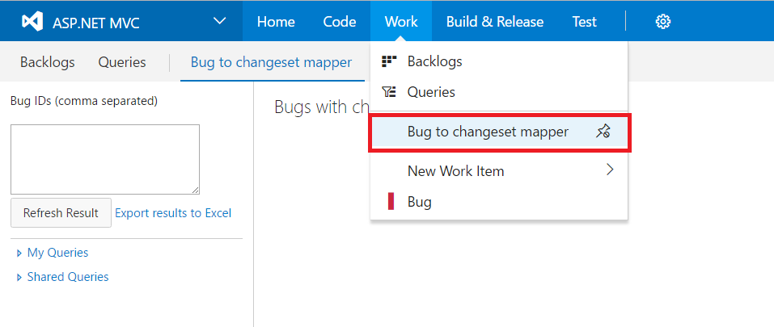
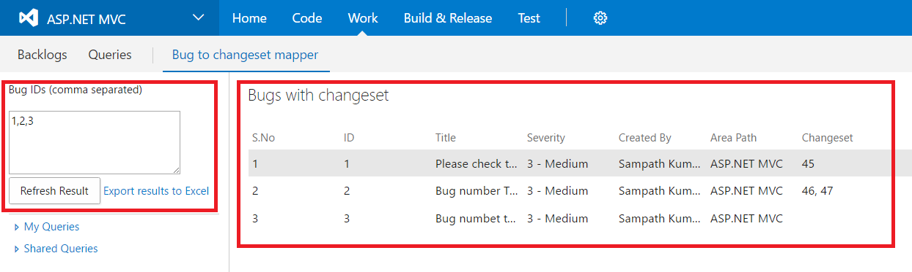
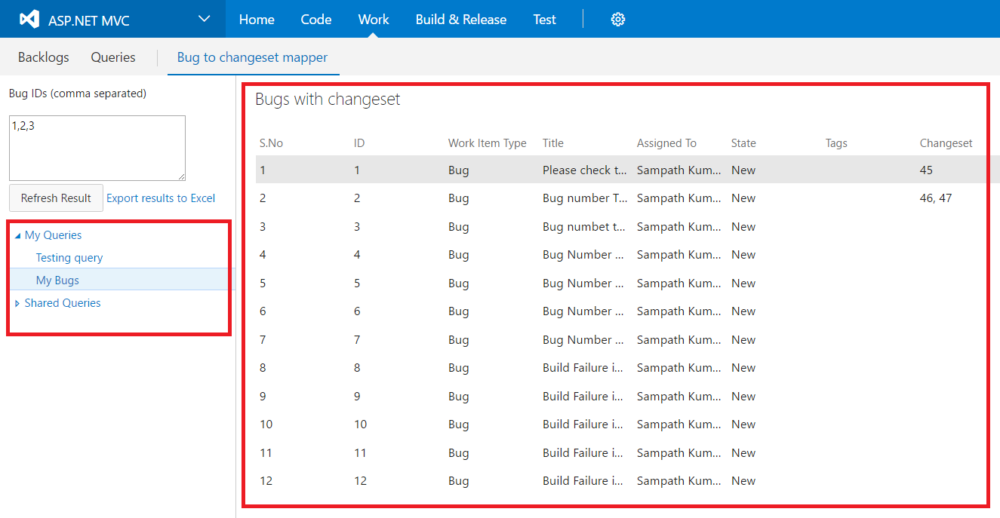
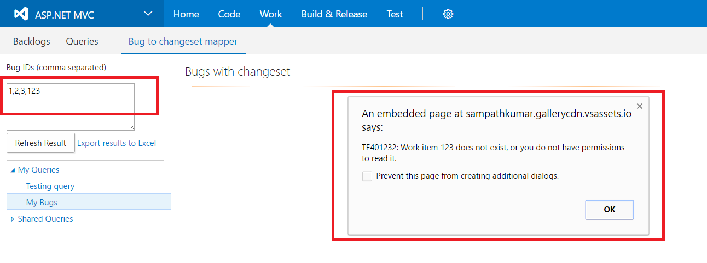

**Bug to changeset mapper** extension helps you to quickly retieve changeset(s) associated with one or more Bugs.

After installation, this extension is accessible from a menu item under **Work** menu group.

Use any of the following options to retrieve changeset(s) associated with bugs:
 - **Input comma separated Bug Id(s)**
If you know the Bug Id(s) and would like to know the associated changesets then this the option to use. Input one or more comma separated Bug Id(s) and click **Refresh Result** to retrieve and display the results in the grid.

 - **Use one of your existing queries**
 This extension populates all of your Shared and Personal queries in the left pane. If you already have a query listed here, you can use that query to fetch the changeset(s) associated with bugs under the query. Just click on the query to fetch the changeset numbers.

 

 Using either of the above options, you can get the results displayed in grid. These results can be exported an excel document, by using the **Export results to Excel** link.

 This extension shows any errors or warnings in the alert pop-up box.

 